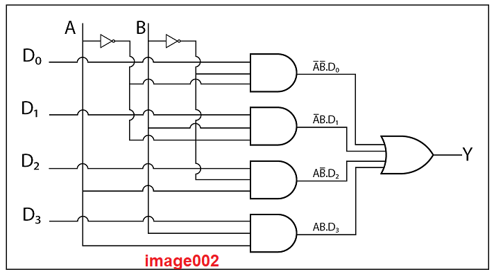

## <b> Pre-test</b>
#### Please attempt the following questions

<pre>
1) A multiplexer using basic gates is shown in the figure given image002. If A = B = 11 and D0 D1 D2 D3 = 1001, then the output of the circuit is:
</img>
    a. zero.
    <b>b. one.</b>

2) What if the select inputs in image002 are set to A = B = 0 1 and the data inputs are set to D0 D1 D2 D3 = 0100? The output Y is:
    a. zero.
    <b>b. one.</b>

3) How many select lines are required for a 4: 1 Mux?
    <b>a. Two </b>
    b. Four
    c. Five
    d. Eight

4) Any multiplexer can be designed using  universal logic gates. State True or False.
    <b>a. True </b>
    b. False

</pre>