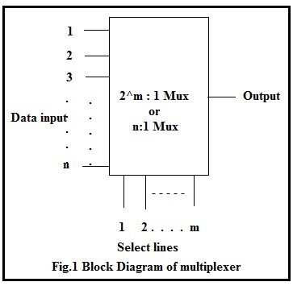
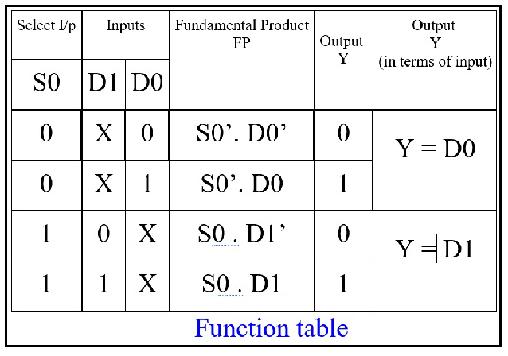
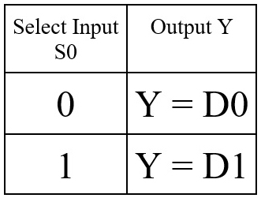
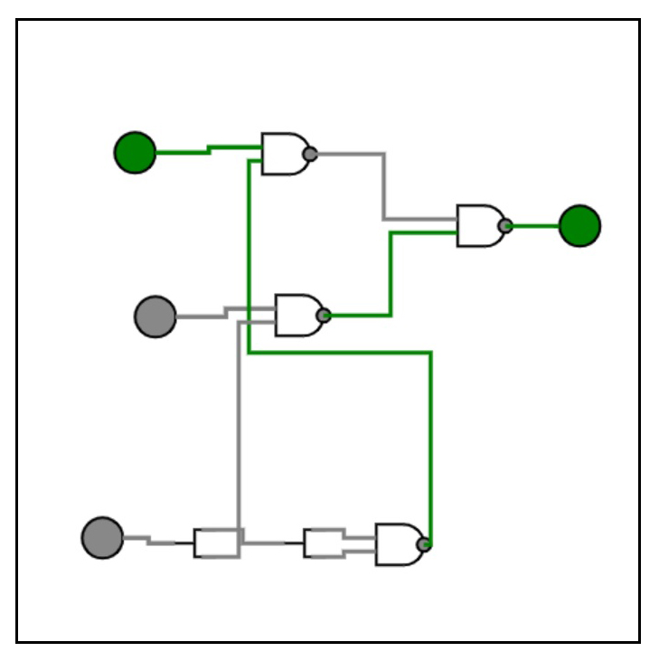
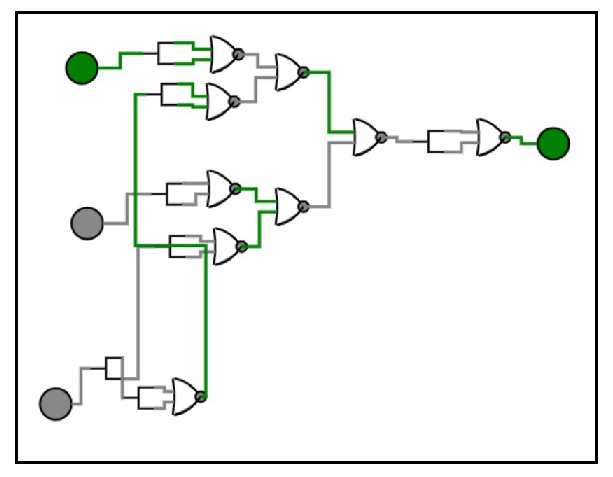
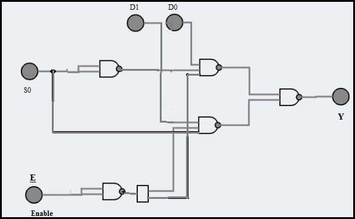
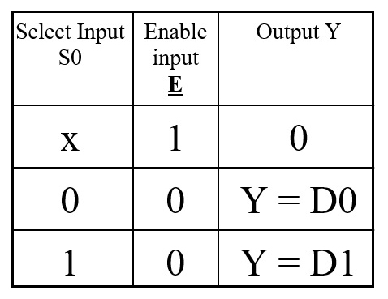

<justify>
<b>1.1 Introduction</b>
 
Whenever there is a need to connect multiple input devices, one at a time, to a system, then a digital combinational circuit called multiplexer is useful.
A digital multiplexer is similar to a multi-position switch with many inputs and only one output. It has control inputs to select a particular input. A multiplexer has m select lines, 2^m inputs and only one output as shown in the figure.
 

 

It is easier to build multiplexers using gates (small scale integration -SSI ICs) for a few select lines. 
A 2:1(read as 2 as to 1) multiplexer can be designed using:
 
a.	Basic logic gates
 
b.	Universal gates (NAND & NOR).
 
A simple 2:1 Mux will have 2 input lines D0 & D1 and one select line S0 and a single output Y.
The select line can take a value either 0 or 1:
 
a.	If S0 takes a value 0, the input D0 is selected and the output Y = D0. 
 
b.	If S0 takes a value 1, the input D1 is selected and the output Y = D1.
 
<b>1.2.1 Theoretical Design:</b>  
a.	Prepare the function table of the 2:1 Mux:
 

 

b. Formulate the expression for output Y by considering only those FPs for which the output is 1.
Y = S0’. D0 + S0 . D1
The simplified function can be tabulated as:

 

 

c. Draw the logic diagram for the expression using only NAND gates:

 

 

Draw the logic diagram for the expression using only NOR gates:

 

 

d. Using simulator construct the circuit and verify its operation.
e. The same circuit can also be designed by having an active low enable input as shown below (Example for NAND gate Mux with enable):

 

 

The simplified function with active low enable input can be tabulated as:

 

</justify>