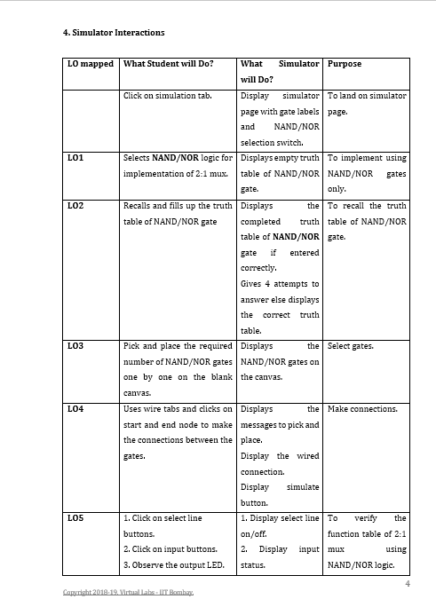
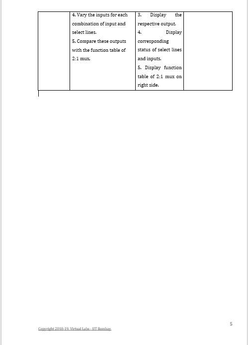

# **Development of Virtual Lab : Round 1 (R1)**
**Name of Faculty**: Prof. Mrs Tanuja Sachin Khatavkar  
**Institute**: PVG’s College of Engineering & Technology, Pune-09  
**Email ID**: tanutsk@gmail.com  
**Discipline to which the Lab belongs**: Electronics & Communication  
**Name of the Lab**: Digital Logic Design Using Gates  
**Name of Experiment**: Design of multiplexer circuits using universal gates.

  Kindly refer these documents before filling the worksheet  

**1. Guidelines** :  
a. Handout for R1 Overall Summary : http://bit.ly/Vlabs-Dev_Handout_Summary_R1   
b. Handout R1 for topics 1 & 2 : http://bit.ly/Vlabs-Dev_Handout_1_R1  
c. Handout R1 for topics 3 & 4:  http://bit.ly/Vlabs-Dev_Handout2_R1  
d. Presentation  on Learning Objectives: http://bit.ly/Vlabs-Dev_LO-ppt  
**2. Samples of R1** :  
Fluid-Mechanics: : http://bit.ly/Fluid-Mech_R1_Sample  
Digital-Electronics-Lab:  http://bit.ly/Digital_elec_R1_Sample  
Numerical-Methods-Lab:  http://bit.ly/Numerical-Method_R1_Sample  

##  1.1 FOCUS AREA : Experimentation
### 1.2 About the Experiment :
Any basic logic gate can be constructed using the universal gates viz. the NAND & NOR gates.  This experiment involves combination of universal gates viz. NAND & NOR gates to design a 2:1 Mux. It provides the user the choice to build 2:1 Mux using either NAND gates only or NOR gates only. This method ensures the use of only one-type of gates for the entire design.
### 1.3 Learning Objectives & Cognitive Levels :

|Sr. No. |Learning Objective |Cognitive Level |Action Verb|
|--------|-------------------|----------------|-----------|
|1.	|Students will be able to select NAND/NOR gate option for the design.|	Recall|	Select
|2.|	Students will be able to recall the truth table of NAND/NOR gates.|	Recall|	Recall
|3.	|The student will be able to select NAND/NOR gates for 2:1 design.|	Apply|	Select
|4.	|The student will be able to construct 2:1 mux by making appropriate connections between NAND/NOR gates.	|Apply	|Construct
|5.	|The student will be able to compare the simulation output and the function table.	|Analyze	|Compare

## 2.1. Instructional Strategy : Problem Based
### 2.2. Assessment Method : Formative Assessment
### 2.3. Description of sections :
 Problem statement of designing a 2:1 mux using NAND  or NOR gates is proposed in this experiment.  

 ### 3. Task & Assessment Questions

 |Sr No.| Learning Objective to be met| Tasks to be performed by the students |Assessment questions aligned to the task|
 |------|----------------------------|--------------------------------------------|----------------------------------------|
 |1.|	Students will be able to select NAND/NOR gate option for the design.	|Click on option NAND/NOR.	|Select the universal gate for design.
|2.|	Students will be able to recall the truth table of NAND/NOR gates.|	Fill up the truth table of NAND/NOR gate.|	Based on truth table.
|3.	|The student will be able to select NAND/NOR gates for 2:1 design.	|Pick and place the required number of NAND/NOR gates on the canvas.
|4.|	The student will be able to construct 2:1 mux by making appropriate connections between NAND/NOR gates.|	Make connections between gates using wire option.	|Based on building the circuit.
|5.	|The student will be able to compare the simulation output and the function table.|	Vary the input logic level and select line level to the circuit. Observe the output LED status. Compare with the given function table of 2:1 mux.	|Verify the truth table.

## 4. Simulator Interactions

 
 
 
 
