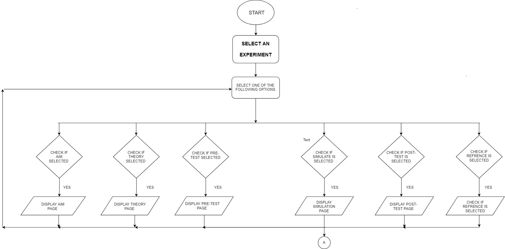
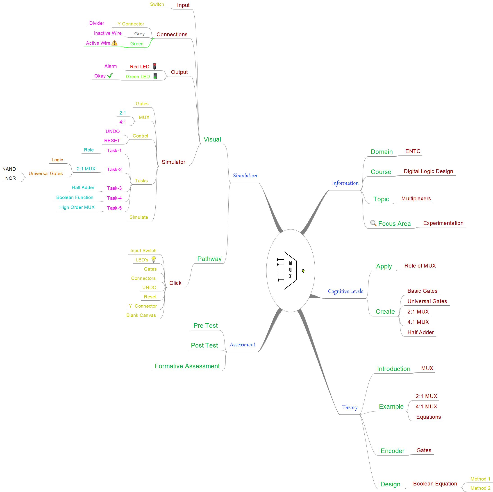
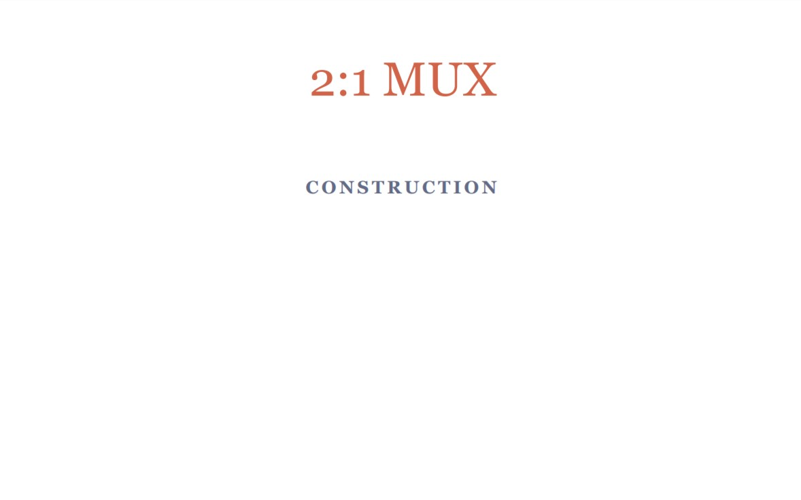
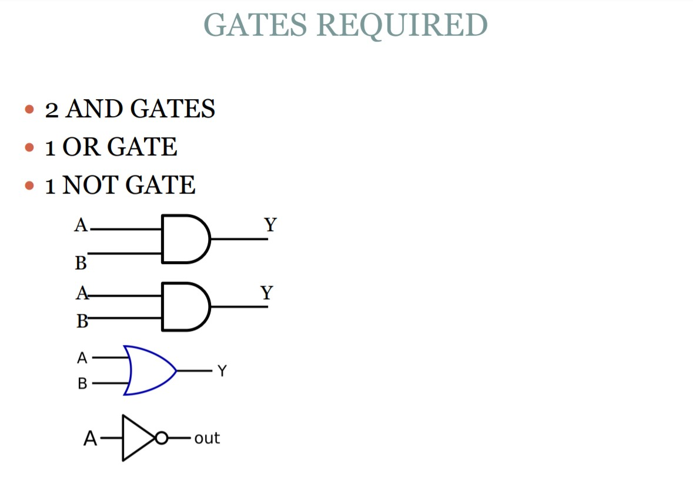
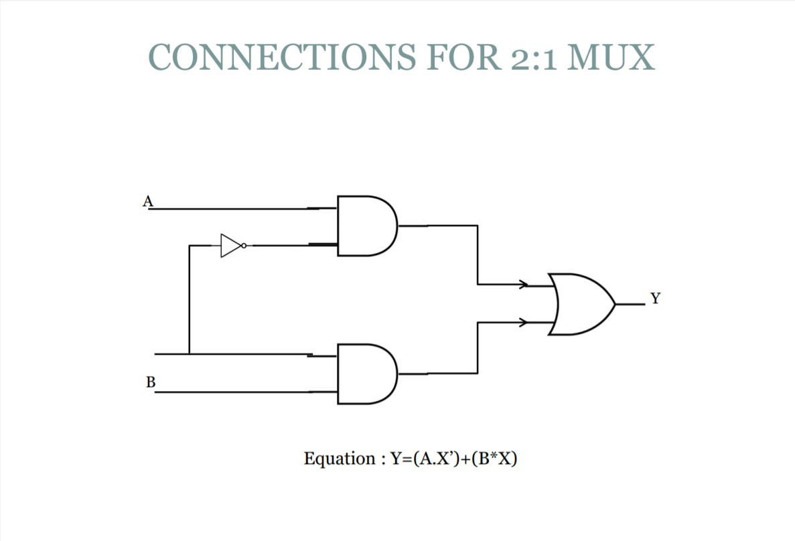
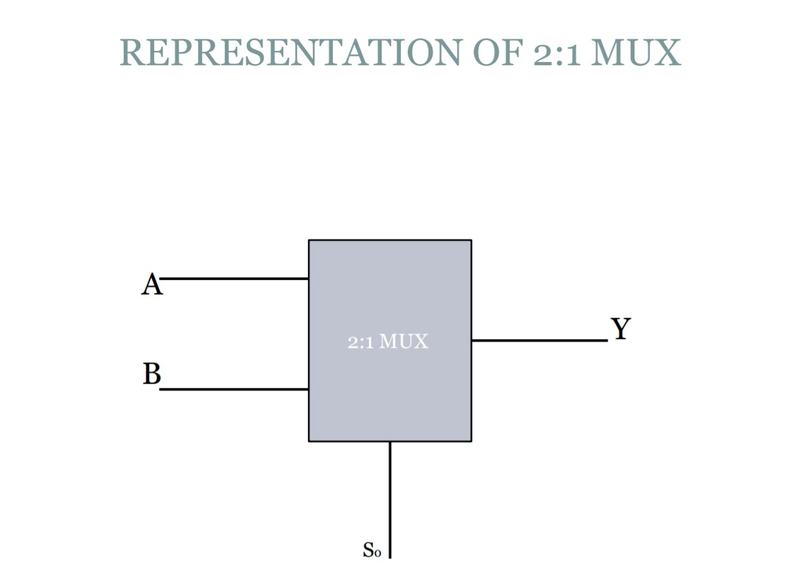
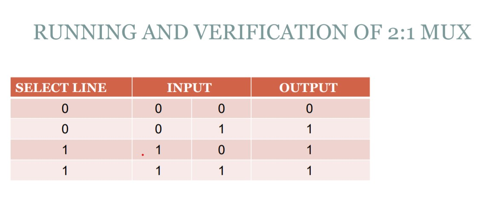

# Development of Virtual lab: Round 2 (R2)-Storyboard
**Name of Faculty**: Prof. Mrs Tanuja Sachin Khatavkar  
**Institute**: PVG’s College of Engineering & Technology, Pune-09  
**Email ID**: tanutsk@gmail.com  
**Discipline to which the Lab belongs**: Electronics & Communication  
**Name of the Lab**: Digital Logic Design Using Gates  
**Name of Experiment**: Design of multiplexer circuits using logic gates.

  Kindly refer these documents before filling the worksheet  

**1.	Coursework (MOOC ) on Pedagogy , Storyboard , Lab Manual :  http://bit.ly/Vlabs-MOOC**  
**2.	Additional Documentation booklet for reference. http://vlabs.iitb.ac.in/vlabs-dev/document.php**  
**3.	Sample Git Repository :**

## 1.  Story Outline: 

Multiplexers are many to one type of devices that work as channel selectors and find applications in real world applications. They can be used to build any digital application, hence may be referred as universal circuit builders. The experiment is a platform for the student to use basic logic gates and build higher order multiplexers that can be used to design any application.

The experiment initially gives a few tasks that enable the user to understand the concept of multiplexing, followed by implementation of multiplexer using basic gates.

## 2.  Story: 
For the experiment being developed an elaborative story is narrated here which gives a logical flow/sequence of activities and covers all details of the entire virtual lab experiment. The story is described in following subsections:

###  2.1. Set the Visual Stage Description: 
Once the student lands on the simulator page the visual stage that should be provides is diagrammatically described for the developer’s better understanding. The visualization is as given below :-

 ###  2.2 Set User Objectives & Goals: 
The objective of framing this experiment is to provide a virtual platform to understand the basics of multiplexer circuits and design lower and higher-order multiplexers. The goal is to enhance the design skill set of students to construct any combinational circuit using multiplexers.

###  2.3. Set the Pathway Activities: 
When the student selects simulator option from the main page, he lands on the simulator page. This canvas displays the various components and various controls required for performing the experiment. Every LO is associated with certain tasks and assessment questions.
To perform any task given :-
1. Student picks the required components and places on the empty canvas one by one.
2. Student picks the input switch/buttons required for the specified task and places on the screen.
3. Student picks and places the output LEDs either RED/Green based on whether to display an alarming situation/ output level indication respectively.
4. Student picks and places the Y connector (divider: when one input is to be connected at two places) on the canvas.
5. Using connect wires options, student makes appropriate connections.
6. When all connections are done, the student clicks on the simulate button.
7. The simulator is now ready and the student changes the inputs by clicking on the input buttons ON/OFF and observes the output displayed on LEDs.
8. Student crosschecks the simulated output against the paperwork design and truth table.

###  2.4. Set Challenges and Questions/Complexity/Variations in Questions: 
The assessment tasks are framed:
1. To pose challenging situations such as design of higher order multiplexer.
2. To pose complex questions that include design of any given open-ended problem.
3. To pose variety in the assessment questions that include designing an 2:1 mux using Basic Logic Gates.  
A good blend of assessment questions enables the student to understand the fundamentals as well as construct complex designs using the simulator and its verification.

###  2.5. Allow pitfalls: 

1. Blank canvas is made available to student. Any pitfall is possible.
2. Allow student to connect any input and output.
3. Input button is a one end object. If student tries to connect gate output as input to input button, it is not allowed.

###  2.6 Conclusion: 

If the student is able to perform all tasks given in this experiment then it can be concluded that the student is able to achieve all the learning objectives at the defined cognitive levels.

Whenever the student completes a given task in first attempt, he scores 5 stars and if completes the task in second attempt, he score 4 stars. If he solves on 3rd attempt he gets 3 stars. Else he uses help option.

 ###  2.7 Equations/formulas:

This experiment includes Boolean Expressions that give the logical connect between the different digital input variables.

###  3. Flowchart 

###  4. Mindmap 

###  5. Storyboard 

